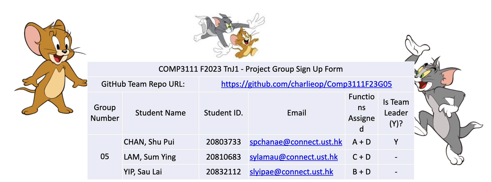

<i style="color: red">You are currently on the <b>MAIN</b> branch. </i>

# Tom & Jerry Maze Racing Game

## About

This is the reop for COMP 3111 F23 project.  
The project aims to build a maze chasing game using java.  
The GUI is build using <ins> not yet decided </ins>. (Swing/ JavaFX/ HTML+CSS/ ...)

## Work Distribution

CHAN, Shu Pui:
- Function: A + D
- UI

LAM, Sum Ying:
- Function: C + D

Yip, Sau Lai:
- Function: B + D

## Useful Links

Here are the useful links:
- [Meeting Logs](https://www.notion.so/dfb2e2b36b2f484b8591e74be9c1da04?v=bd45b47bd3ea4e4cb6b12933569c0d22) (notion.so)

- [Class Diagram](https://app.diagrams.net) (draw.io)

- [Progress](https://www.feishu.cn) (feishu.cn)

- [Burndown Charts]() (null)

