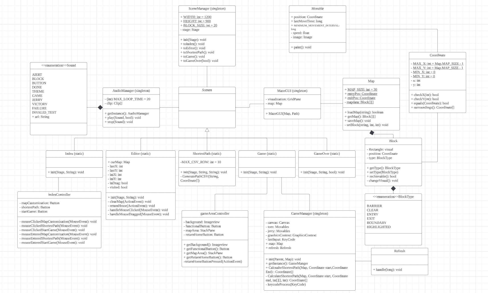

<i style="color: red">You are currently on the <b>MAIN</b> branch. </i>

# Tom & Jerry Maze Racing Game

## About

This is the reop for COMP 3111 F23 project.  
The project aims to build a maze chasing game using java.  
The GUI is build using <ins> JavaFX </ins>.  
The Unit Test uses <ins> JUnit-4 and TestFX </ins>.

## Instructions to play:

In Game:
- Use W, S, A, D to control Jerry the mouse
- Your goal is to reach the cheese before Tom the cat caught you!

In Editor:
- Use your mouse to drag around or click on a block to place/ unplace it
- Drag the entry/ exit to move it

## Work Distribution

CHAN, Shu Pui (charlieop):
- Function: A + D
- In-game UI

LAM, Sum Ying (summyyyy):
- Function: C + D
- Index Page

Yip, Sau Lai (slyipae1):
- Function: B + D
- Game Audio

## UML Class Diagram

## Useful Links

Here are the useful links:
- [Meeting Logs](https://www.notion.so/dfb2e2b36b2f484b8591e74be9c1da04?v=bd45b47bd3ea4e4cb6b12933569c0d22) (notion.so)

- [Class Diagram & Use Case Diagram](https://lucid.app/lucidchart/8d4aab76-8d94-4c77-8ee2-5f24908c90b4/edit?viewport_loc=-965%2C-459%2C1677%2C969%2C0_0&invitationId=inv_66e68831-7bf3-4743-9cbb-c6dfee4a3da1) (lucid.app)

- [Progress](https://github.com/users/charlieop/projects/2) (github project)

- [Unit Test Case Report](https://docs.google.com/spreadsheets/d/1vBfxI6wov-IQjG2OgAkg1qJqWw74wfEOhXO-2ETUfTA/edit?usp=sharingژ)(Google Excel)

